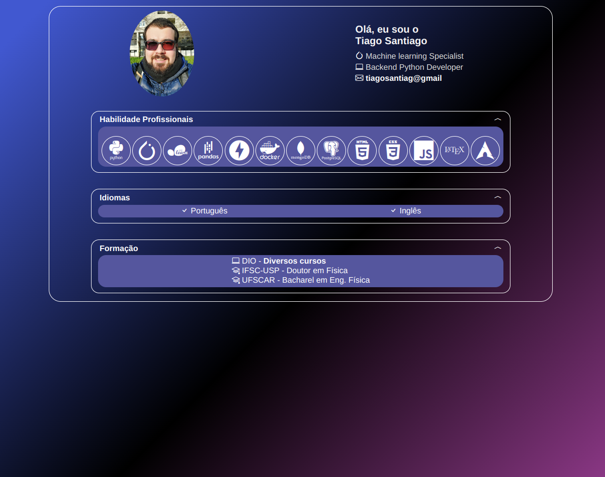

<h1>
<a href="https://www.dio.me/">
     </a>
    <span> Formação JavaScript Developer</span>
</h1>

# :computer: Portfólio Profissional 

Seja criativo(a)! Explore todos os conceitos que aprendemos nessa imersão e replique (ou melhore, porque não) este projeto prático. Para isso, crie seu próprio repositório e, com isso, aumente ainda mais seu portfólio de projetos no GitHub! Lembre-se de que você pode criar sua própria estrutura JSON e deixar a sua página de portfólio profissional totalmente dinâmica e com a sua cara 😎

Página de portfólio do expert, servida via [GitHub Pages](https://renanjpaula.github.io/js-developer-portfolio)

Todo [layout desenvolvido no Figma](https://www.figma.com/file/g6zA6klLrCWZAp76tzoVJZ/Portfolio---EDUCATION?node-id=0%3A1)

## :bulb:  Solução do desafio

Foi feito um layout de portfólio responsivo com código do zero utilizando o layout do Figma como base.

Estrutura do projeto:
```console
DIO_JS_Portfolio/
├── assets
│   ├── images
│   │   └── tiago.png
│   ├── scripts
│   │   └── main.js
│   └── styles
│       ├── global.css
│       ├── main.css
│       └── reset.css
└── index.html
```

<p align=center>
 
 
</p>


A cor de fundo foi gerada usando o código CSS:

```CSS
background-color: #4158D0;
background-image: linear-gradient(135deg, #4158D0 5%, #000 55%, #C850C0 120%);
```

Os itens de habilidades profissionais foram adicionados dinamicamente:

```html
<section class="section__toggle" onclick="toggleSkills(this)">
    <div class="section__title">
    <h2>Habilidade Profissionais</h2>
    <i class="bi bi-chevron-compact-down"></i>
    </div>
    <div class="section__content">
        <ul class="skills__list">
            <!-- Added by JS -->       
        </ul>
    </div>  
</section>
```
```javascript
const skill_list = document.querySelector(".skills__list")
for (const [key, value] of Object.entries(skill_items)) {
    skill_list.innerHTML += `<li class="skills__item">
    <i class="${value}"></i>
    </li>`
}
```
## Links úteis

1. [Gerar Background](https://cssgradient.io/gradient-backgrounds/)

2. [Otimização de imagem](https://tinypng.com/)